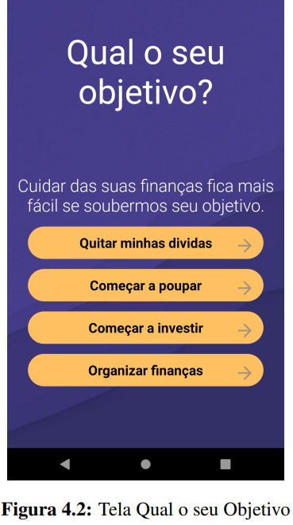
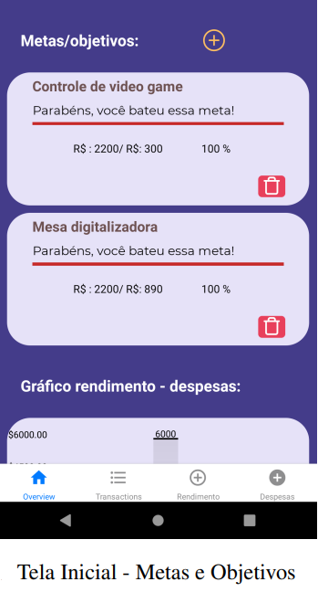
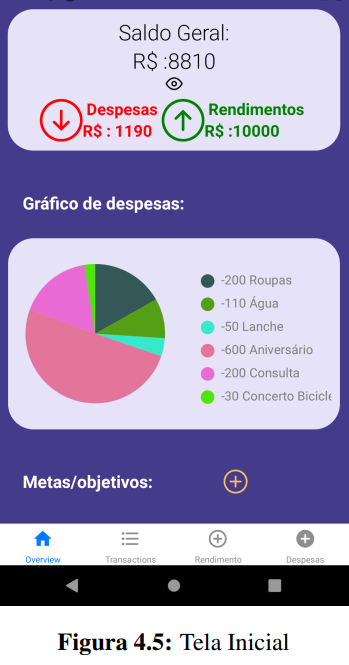
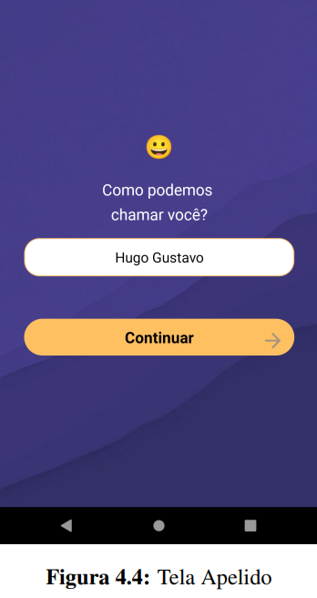
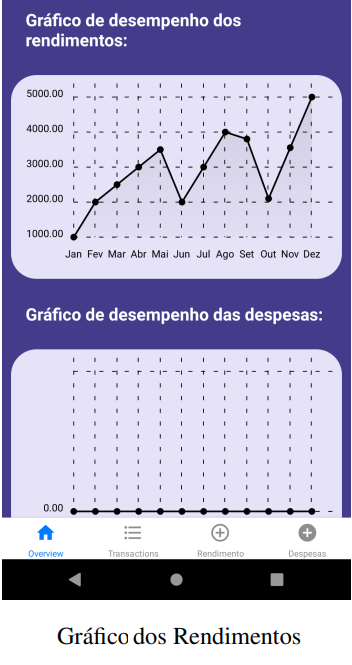
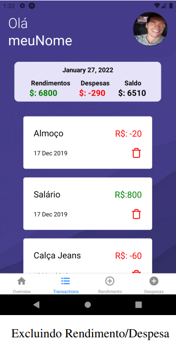
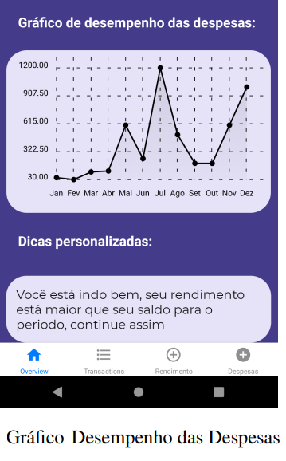
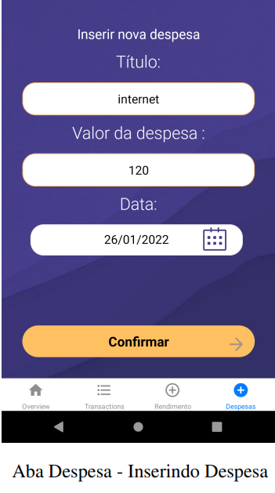

<div align="center">

  <h1>Finances Manager</h1>
    
  <p> App that will help people to manage their finances.</p>
 
</div>

# 👀 About

Financial independence is the dream of many people, the advantages of acquiring it are varied: reaching a comfortable life, being ready for crisis, having money to reach your goals, acquiring goods, investing on yourself. For that to be possible it’s necessary to have a good financial management, about your spending and incomes because, in practice this financial management generates conditions for the individual to decide better on what to do with it’s money, in order to help people in reaching that objective it has been thought about a prototype of an app for financial management. The project has the objective of analyse and evaluate existing proposals in the market and propose a prototype of an app that allows the individual user to control his finances while he lays down goals to better develop his financial management.

<br>
<br>

<table style="padding:10px">
  <tr>
    <td> 
         </td>
 <td></td>
   <td></td>
  </tr>
</table>

<table style="padding:10px">
  <tr>
    <td> 
         </td>
 <td></td>
   <td></td>
  </tr>
</table>

<table style="padding:10px">
  <tr>
    <td> 
         </td>
 <td></td>
   <td></td>
  </tr>
</table>

<table style="padding:10px">
  <tr>
    <td> 
         </td>
 <td></td>

  </tr>
</table>

# 🚀 Technologies

- [Expo](https://expo.io/)
- [React Native](https://reactnative.dev/)
- [TypeScript](https://www.typescriptlang.org/)
- [ESlint](https://eslint.org/)
- [Prettier](https://prettier.io/)
- [EditorConfig](https://editorconfig.org/)
- [Redux] (https://redux.js.org/)

## 💻 Getting started

### Requirements

- [Expo](https://expo.io/)
- [Yarn](https://classic.yarnpkg.com/) or [NPM](https://www.npmjs.com/)

### Installing and running the project

_Clone the project and access the folder_

```bash
$ git clone https://github.com/MateusPequeno/Finances-Manager.git
$ cd Finances-Manager
```

_Follow the steps below_

```bash
# Install the dependencies
$ yarn install

# Run the expo application on an android
$ expo start --android

# Run the expo application on an ios emulator
$ expo start --ios

#You can also scan the QR code after running expo start to open the app on your personal device.

# Well done, FinancesManager is started!
```

<br>
